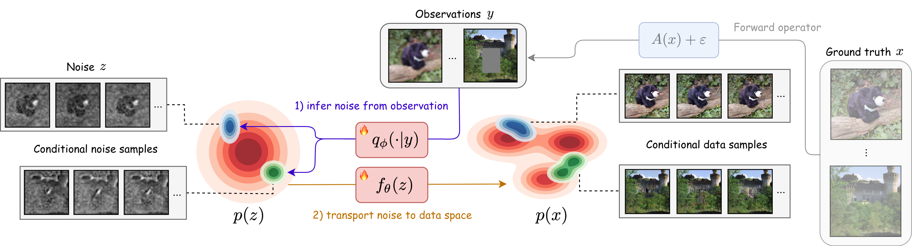

<div align="center">

# Variational Flow Maps: <br> Make Some Noise for One-Step Conditional Generation

**[Abbas Mammadov](https://abbasmammadov.github.io/)**<sup>1,&#42;</sup> &nbsp;&nbsp; **[So Takao](https://www.sotakao.com/)**<sup>2,3,&#42;</sup> &nbsp;&nbsp; **[Bohan Chen](https://chenbh.com/)**<sup>2</sup> &nbsp;&nbsp; **[Ricardo Baptista](https://www.ricardobaptista.com/)**<sup>4</sup> &nbsp;&nbsp; **[Morteza Mardani](https://mortezamardani.github.io/morteza/)**<sup>5</sup> &nbsp;&nbsp; **[Yee Whye Teh](https://www.stats.ox.ac.uk/~teh/)**<sup>1</sup> &nbsp;&nbsp; **[Julius Berner](https://jberner.info/)**<sup>5</sup>

<sup>1</sup>Department of Statistics, University of Oxford &nbsp;&nbsp; <sup>2</sup>California Institute of Technology <br> <sup>3</sup>PhysicsX &nbsp;&nbsp; <sup>4</sup>University of Toronto &nbsp;&nbsp; <sup>5</sup>NVIDIA <br>
<sup>*</sup>*Equal contribution*

[](https://arxiv.org/pdf/2603.07276)

Official Implementation of "Variational Flow Maps: Make Some Noise for One-Step Conditional Generation"

</div>

<p align="center">
  
</p>

**Summary:** Variational Flow Maps (VFM) enable one/few-step **conditional** generation with flow maps. Given an observation $y$, we learn a **noise adapter** $q_\phi(z\mid y)$ that outputs a noise distribution such that mapping it through a **flow map** $x = f_\theta(z)$ yields samples consistent with both the observation and the data prior. Rather than steering a sampling trajectory, VFM *learns the proper initial noise* - so a single evaluation $x = f_\theta(z)$ produces a posterior sample. The adapter and flow map are trained **jointly** with a principled variational objective, letting the flow map reshape the noise→data coupling so a simple Gaussian adapter can fit a complex posterior. VFM produces well-calibrated conditional samples for inverse problems in a single (or few) steps, and competitive ImageNet fidelity orders of magnitude faster than iterative diffusion/flow models.

### 1. Environment setup

```bash
conda create -n vfm python=3.10 -y
conda activate vfm
pip install torch torchvision
pip install -r requirements.txt
```

**Flash Attention.** Flow Map training uses a forward-mode (JVP) attention kernel. For the fastest training on Hopper GPUs (H100/H200), build **Flash Attention v3** from source and launch via our SLURM helper [`scripts/slurm/build_flash_attn.slurm`](scripts/slurm/build_flash_attn.slurm), then use `--attn-func fa3`. Otherwise you can use **Flash Attention v2** (`--attn-func fa2`) by installing via pypi, or fall back to the built-in naive attention (`--attn-func base`), which is slower but requires no extra install.

### 2. Dataset

We use [ImageNet](https://www.kaggle.com/c/imagenet-object-localization-challenge). Simply download the raw dataset and point `--data-dir` to the extracted `train/` folder - the training code reads the raw images directly and handles the rest. (The `preprocessing/` folder is only needed to compute FID.)

### 3. Training

VFM jointly trains the noise adapter with the flow map, fine-tuning from a pretrained flow-map or flow-matching backbone. A minimal launch:

```bash
accelerate launch train_adapter.py \
  --data-dir $DATA_DIR \
  --pretrained $PRETRAINED_CKPT --pretrained-sigma \
  --model "DMFT-B/2" --dmf-depth 8 \
  --adapter-model base --num-inv-probs 6 \
  --attn-func "fa2" \
  --g-type "mg" --omega 0.5 \
  --P-mean 0.0 --P-mean-t 0.4 --P-mean-r -1.2
```

This creates an experiment folder under `exps/` with logs and checkpoints. See [`scripts/train_imagenet.sh`](scripts/train_imagenet.sh) (single node) and [`scripts/slurm/train.slurm`](scripts/slurm/train.slurm) (multi-node) for full launchers. Key options:

- `--model`: `[DMFT-B/2, DMFT-L/2, DMFT-XL/2]` - flow-map backbone.
- `--dmf-depth`: encoder depth of the Decoupled MeanFlow transformer.
- `--adapter-model`: `[small, base, large]` - noise-adapter size.
- `--num-inv-probs`: number of inverse problems the adapter is conditioned on.
- `--attn-func`: `["fa3", "fa2", "base"]` (see Environment setup).
- `--g-type`: `["default", "mg", "distill"]`; `mg` is model guidance (default).
- `--omega`, `--g-min`, `--g-max`: guidance scale and interval for `mg`.
- `--P-mean`, `--P-mean-t`, `--P-mean-r`: time proposal distributions.

### 4. Conditional sampling (inverse problems)

Given a trained checkpoint, draw one/few-step posterior samples for an observation. The observation is synthesised from a clean image with the chosen forward operator:

```bash
python sample_inverse.py \
  --ckpt YOUR_CHECKPOINT_PATH \
  --image path/to/image.png \
  --problem super_resolution \
  --class-label 279 \
  --num-samples 8 \
  --num-steps 1
```

`--problem` ∈ `{identity, inpaint_random, inpaint_box, super_resolution, gaussian_blur, motion_blur}`. The observation and each posterior sample are written to `--out`; increase `--num-steps` (e.g. 2–4) for few-step refinement.

### 5. Quickstart: 2D checkerboard demo

For a self-contained illustration (single GPU / CPU, a few minutes), jointly train the adapter with a MeanFlow map on the checkerboard distribution using the shipped toy checkpoint:

```bash
bash scripts/train_checkerboard.sh
```

### Checkpoints

We release the VFM checkpoint [here](https://github.com/abbasmammadov/VFM).

## Acknowledgement

This code is mainly built upon [DMF](https://github.com/kyungmnlee/dmf), [DiT](https://github.com/facebookresearch/DiT), [SiT](https://github.com/willisma/SiT), [edm2](https://github.com/NVlabs/edm2), and [DPS](https://github.com/DPS2022/diffusion-posterior-sampling).

## Citation
If you find this work useful, please cite our paper:

```bibtex
@misc{mammadov2026variationalflowmapsmake,
      title={Variational Flow Maps: Make Some Noise for One-Step Conditional Generation}, 
      author={Abbas Mammadov and So Takao and Bohan Chen and Ricardo Baptista and Morteza Mardani and Yee Whye Teh and Julius Berner},
      year={2026},
      eprint={2603.07276},
      archivePrefix={arXiv},
      primaryClass={cs.CV},
      url={https://arxiv.org/abs/2603.07276}, 
}
```
